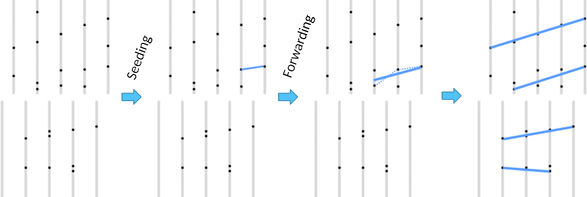

Track reconstruction made easy
==============================

This is a pet project to do track reconstruction,
based on real data coming from the LHCb detector at CERN.

Think you can make it better? Go ahead and try!

>    python3 run_track_reconstruction.py

What is track reconstruction?
-----------------------------

At the LHCb detector, millions of particles collide at speeds
close to the speed of light, leaving traces (hits) on the modules
placed in their way.

The collisions that happen at the same time are packed
into an *event*, and sent to one of our servers,
that must reconstruct the tracks that formed each particle
in real time.

This project contains events in json format. These events are
then processed by some reconstruction algorithm, and finally
the results are validated. That is, the particles found by
the solver are matched against the real particles that came out of
the collisions in the event.

The algorithm included is just one way of doing it, but perhaps
not the most efficient one!

Diving into details
-------------------

Input files are specified in json. An *event model* to parse them
is shipped with this project.

    $ python3
    Python 3.4.3 (default, Mar 31 2016, 20:42:37) 
    [GCC 5.3.1 20151207 (Red Hat 5.3.1-2)] on linux
    Type "help", "copyright", "credits" or "license" for more information.
    > from event_model import event_model as em
    > import json
    > f = open("events/velo_event_0.json")
    > json_data = json.loads(f.read())
    > event = em.event(json_data)
    > f.close()

The LHCb Velopix detector has 52 modules. Spread across the modules,
we should have many hits, depending on the event we are on.

    > print(len(event.modules))
    52
    > print(len(event.hits))
    996

Hits are composed of an ID, and {x, y, z} coordinates.

    > print(event.hits[0])
    #0 id 0 module 0 {9.18, -30.509, -288.08}

modules are placed at some z in the detector. Each module
may have as many hits as particles crossed by it, plus some noise to
make things interesting.

    > print(event.modules[0])
    module 0:
     At z: {-288.08, -286.918}
     Number of hits: 20
     Hits (#id {x, y, z}): [#0 id 0 module 0 {9.18, -30.509, -288.08}, #1 id 1 module 0 {-9.137, -12.308, -288.08}, #2 id 2 module 0 {-8.806, -8.711, -288.08}, #3 id 3 module 0 {-9.623, -5.171, -288.08}, #4 id 4 module 0 {-21.73, -20.093, -286.918}, #5 id 5 module 0 {-16.422, -19.918, -286.918}, #6 id 6 module 0 {-12.455, -24.43, -286.918}, #7 id 7 module 0 {-11.832, -24.818, -286.918}, #8 id 8 module 0 {-7.827, -28.124, -286.918}, #9 id 9 module 0 {8.759, -44.478, -286.918}, #10 id 10 module 0 {-5.415, -22.407, -286.918}, #11 id 11 module 0 {-4.365, -34.152, -286.918}, #12 id 12 module 0 {-7.574, -37.711, -286.918}, #13 id 13 module 0 {-7.418, -37.75, -286.918}, #14 id 14 module 0 {-5.424, 6.221, -286.918}, #15 id 15 module 0 {-11.005, 11.49, -286.918}, #16 id 16 module 0 {-28.292, -8.771, -286.918}, #17 id 17 module 0 {-39.789, 6.663, -288.08}, #18 id 18 module 0 {-33.795, 2.468, -288.08}, #19 id 19 module 0 {-15.458, 15.438, -288.08}]

A simplistic implementation runs through all modules sequentially,
finding tracks by matching hits in a straight line.

    > from algorithms.track_forwarding import track_forwarding
    > tracks = track_forwarding().solve(event)
    Instantiating track_forwarding solver with parameters
     max slopes: (0.7, 0.7)
     max tolerance: (0.4, 0.4)
     max scatter: 0.4
    > len(tracks)
    148
    > print(tracks[0])
    Track with 9 hits: [#985 id 985 module 51 {-8.343, 17.073, 749.419}, #962 id 962 module 49 {-7.759, 15.945, 699.419}, #941 id 941 module 47 {-7.215, 14.779, 649.419}, #908 id 908 module 44 {-6.533, 13.318, 588.081}, #881 id 881 module 42 {-5.366, 10.985, 488.081}, #852 id 852 module 40 {-4.16, 8.613, 388.081}, #823 id 823 module 38 {-3.246, 6.843, 313.081}, #788 id 788 module 36 {-2.682, 5.657, 263.081}, #750 id 750 module 34 {-2.371, 5.035, 238.081}]

Finally, we should validate these results, and we'll look
at three things:

*   Reconstruction Efficiency: The fraction of real particles we have reconstructed.
    > \# correctly reconstructed / \# real tracks

*   Clone Tracks: Tracks that are similar to other correctly reconstructed tracks.
    > \# clone tracks / \# correctly reconstructed

*   Ghost Tracks: Tracks that are incorrect, either created by noise or by incorrectly reconstructing a track.
    > \# incorrectly reconstructed / \# all reconstructed

We will get the validation detailed for different kinds of particles.

    > from validator import validator_lite as vl
    > vl.validate_print([json_data], [tracks])
    148 tracks including        8 ghosts (  5.4%). Event average   5.4%
                  velo :      126 from      134 ( 94.0%,  94.0%)        3 clones (  2.38%), purity: ( 98.83%,  98.83%),  hitEff: ( 93.89%,  93.89%)
                  long :       22 from       22 (100.0%, 100.0%)        1 clones (  4.55%), purity: ( 99.52%,  99.52%),  hitEff: ( 93.80%,  93.80%)
             long>5GeV :        8 from        8 (100.0%, 100.0%)        0 clones (  0.00%), purity: (100.00%, 100.00%),  hitEff: (100.00%, 100.00%)
